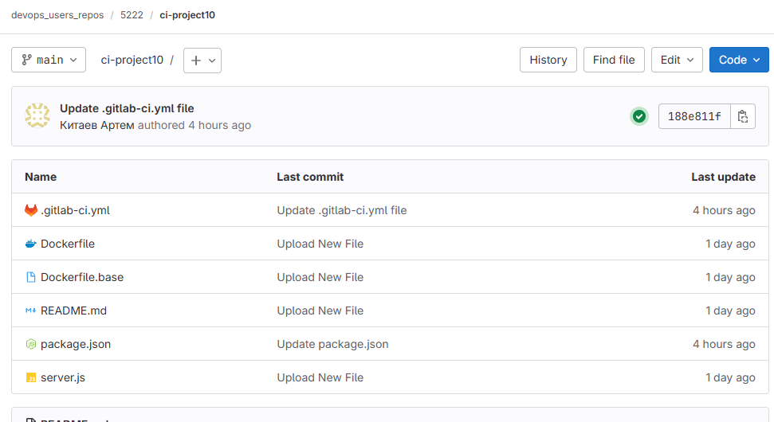

# Практическое задание
## Gitlab CI: Tips

## Задание

```
Перепишете код конвейера, из примера с использованием extends, rules:

Вынесите код задач в отдельные файлы в другой репозиторий.
Используя include, добавьте код задач из extends.
Для стадии загрузки образа в докер-регистр напишите условие, ограничивающее выполнение этой задачи только при merge-реквесте в главную ветку (main/master).
В качестве ответа предоставьте либо ссылки на открытые репозитории с модулями и основным кодом конвейера, либо сами yaml-файлы

```

# Steps:



```sh
# Установка GitLab Runner
curl -L https://packages.gitlab.com/install/repositories/runner/gitlab-runner/script.deb.sh | sudo bash
sudo apt-get install -y gitlab-runner

sudo systemctl enable --now docker

gitlab-runner register  --url https://gitlab.rebrainme.com  --token glrt-Ny2jxBZbyp7r1LHdvbKU

sudo gitlab-runner register \
  --non-interactive \
  --url "https://gitlab.rebrainme.com/" \
  --registration-token "glrt-Ny2jxBZbyp7r1LHdvbKU" \
  --executor "docker" \
  --docker-image "alpine:latest" \
  --description "Docker Runner" \
  --tag-list "docker-privileged" \
  --docker-privileged \
  --docker-volumes "/var/run/docker.sock:/var/run/docker.sock"

```